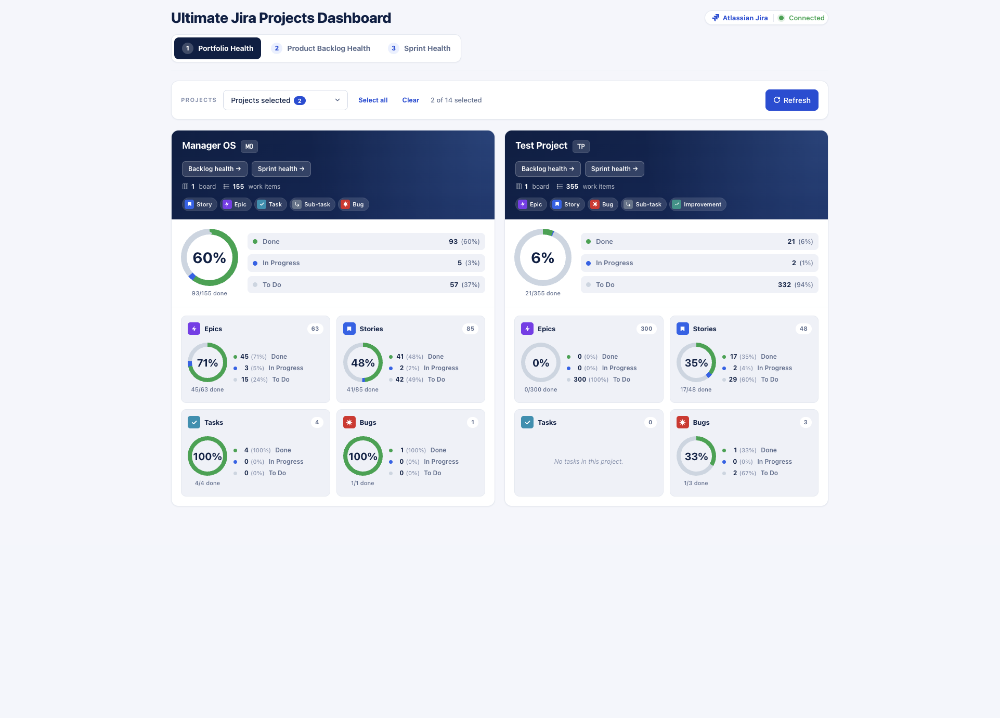
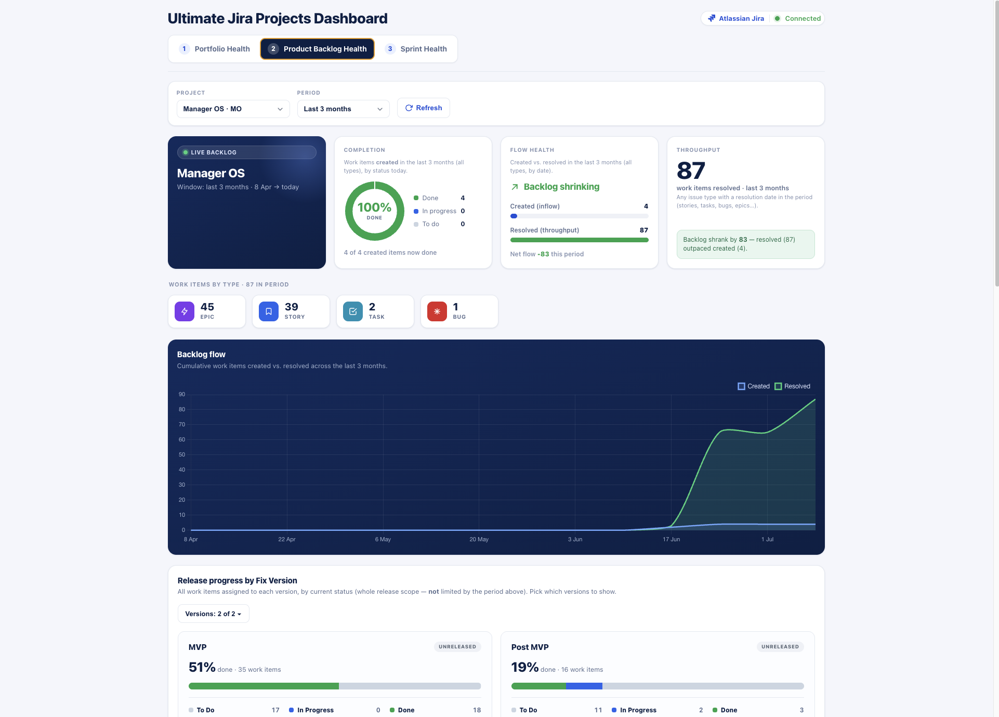
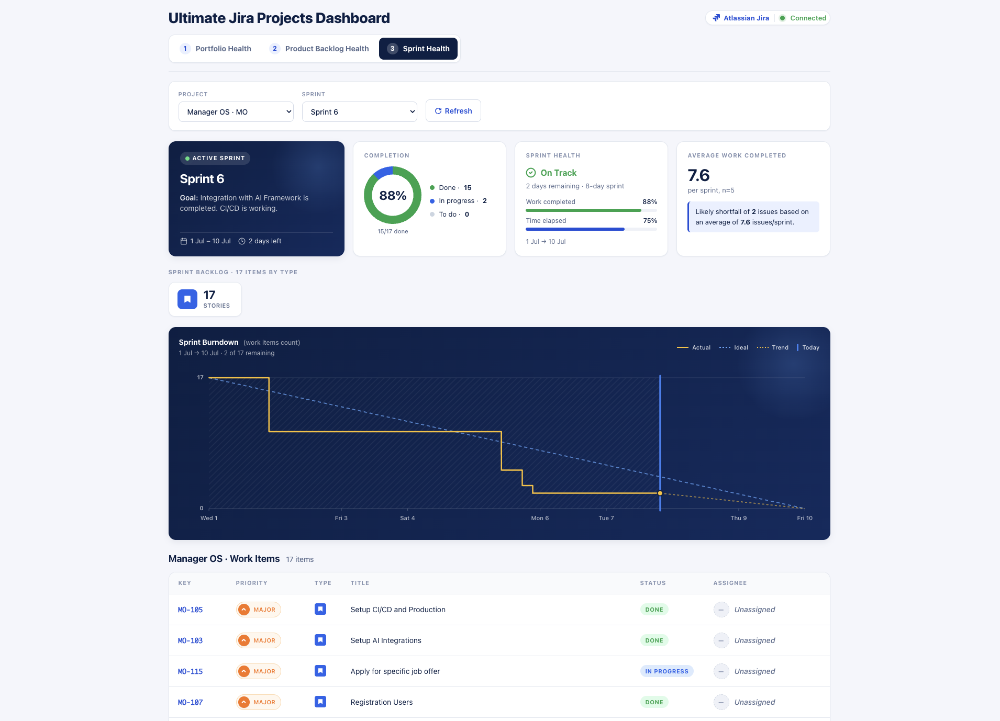

# Ultimate Jira Projects Dashboard — Description

Copy‑ready descriptions for the artifact (GitHub “About”, artifact subtitle, docs, etc.).

---

## Overall

**One‑liner**

> A live, three‑level Jira dashboard for product & project managers — portfolio, backlog, and sprint health in one place.

**Short paragraph**

> The Ultimate Jira Projects Dashboard brings three levels of Jira health into a single live view: high‑level **Portfolio** health across many projects, mid‑level **Product Backlog** flow and delivery health, and detailed **Sprint** health. Pick a project once and it carries through the tabs, so you can go from a portfolio‑wide overview down to a specific sprint in two clicks. Data is pulled live from Atlassian Jira and refreshed on every tab switch.

**Longer paragraph** (for a README intro or listing)

> A single, self‑contained dashboard that unifies portfolio, backlog, and sprint reporting for Jira. Navigate three drill‑down levels — from a multi‑project portfolio overview, to backlog flow, fix‑version release progress and lead/cycle time, down to an active sprint’s burndown and velocity forecast. Selecting a project on the Portfolio tab pre‑fills the Backlog and Sprint tabs, and non‑Scrum projects are handled gracefully. Every tab always fetches current data (no stale cache), with a live connection status indicator. Built to run as a Claude Cowork live artifact against your authorized Atlassian/Jira connector.

---

## Tab 1 — Portfolio Health

> **High‑level, multi‑project overview.** Pick one or more projects and get a scorecard for each: an overall completion donut (Done / In Progress / To Do) with counts and percentages, board and work‑item totals, and per‑type panels for Epics, Stories, Tasks, and Bugs — each with its own mini‑donut and breakdown. From any project card you can jump straight into its Backlog or Sprint health.

**At a glance**

- Multi‑select project picker (Select all / Clear / count) + Refresh
- Per‑project completion donut and status split (Done / In Progress / To Do)
- Board count and total work items
- Per‑type panels: Epics, Stories, Tasks, Bugs
- Drill‑down buttons to a project’s Backlog or Sprint health

---

## Tab 2 — Product Backlog Health

> **Mid‑level delivery and flow health for one project.** Choose a project and a time window (2 weeks / 1 / 3 / 6 months). See a completion donut for work created in the period, flow health (created vs. resolved and net flow), and throughput with a plain‑language insight. Below: a cumulative created‑vs‑resolved trend, release progress by Fix Version (with per‑status and per‑type breakdown), created‑vs‑resolved bars by work‑item type, lead‑time and cycle‑time analysis (chart + table), and a paginated work‑items table.

**At a glance**

- Project + period selector (2w / 1m / 3m / 6m) + Refresh
- Completion donut for work created in the period
- Flow health: created vs. resolved, net flow, throughput + insight
- Work‑items‑by‑type chips
- Cumulative created‑vs‑resolved trend chart
- Release progress by Fix Version (per‑status and per‑type)
- Created‑vs‑resolved bars by work‑item type
- Lead time & cycle time by type (chart + table)
- Paginated work‑items table

> *Definitions:* **Lead time** = created → resolved (includes backlog wait). **Cycle time** = first In Progress → resolved (active work). The gap is queue/wait time.

---

## Tab 3 — Sprint Health

> **Detailed view of a single sprint.** Select a project and a sprint (active / future / completed). The active‑sprint hero shows the goal and dates, alongside a completion donut, a sprint‑health read (work completed vs. time elapsed → On Track / Watch / At Risk), and an average‑work‑completed velocity forecast (with likely shortfall) based on past sprints. Below: the sprint backlog by issue type, a burndown chart (actual vs. ideal, with trend and “today” marker), and a paginated work‑items table with key, priority, type, title, status, and assignee.

**At a glance**

- Project + sprint selector (Active / Future / Completed) + Refresh
- Active‑sprint hero: goal, dates, days remaining
- Completion donut (Done / In Progress / To Do)
- Sprint health: work completed vs. time elapsed → On Track / Watch / At Risk
- Average work completed (velocity forecast + likely shortfall)
- Sprint backlog by issue type
- Burndown chart (actual, ideal, trend, today marker)
- Paginated work‑items table (key, priority, type, title, status, assignee)

---

## Notes

- Runs as a **Claude Cowork live artifact**; it pulls live data through your authorized Atlassian/Jira connector and only shows data when opened from the Cowork sidebar.
- Not affiliated with or endorsed by Atlassian. “Jira” is a trademark of Atlassian.
