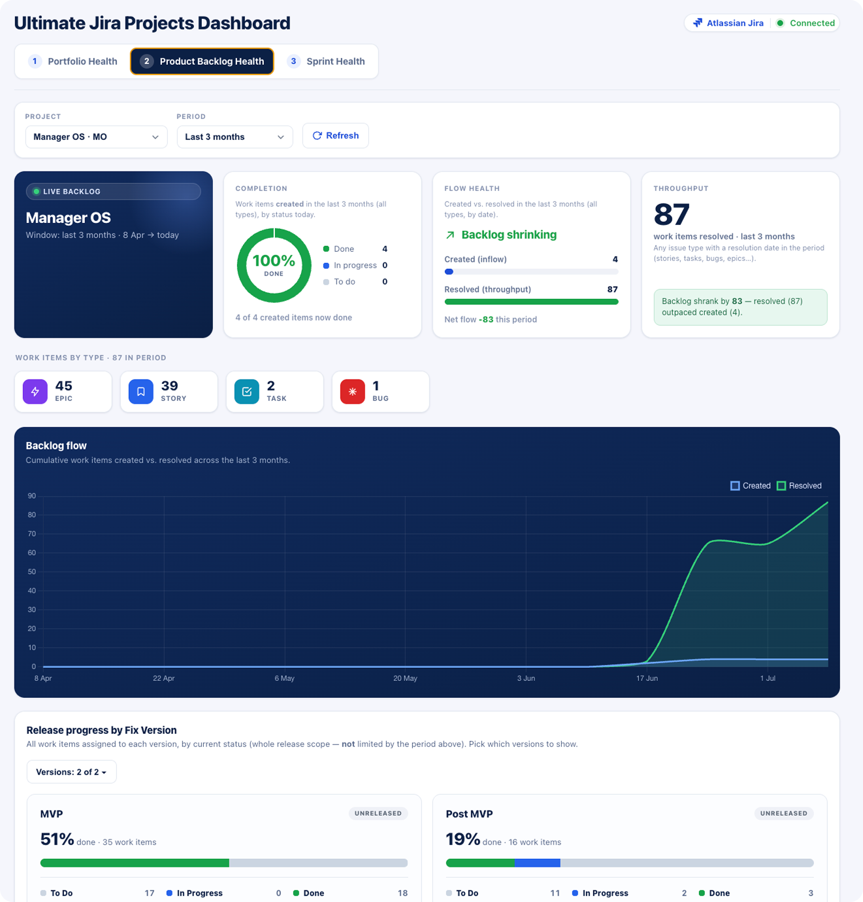
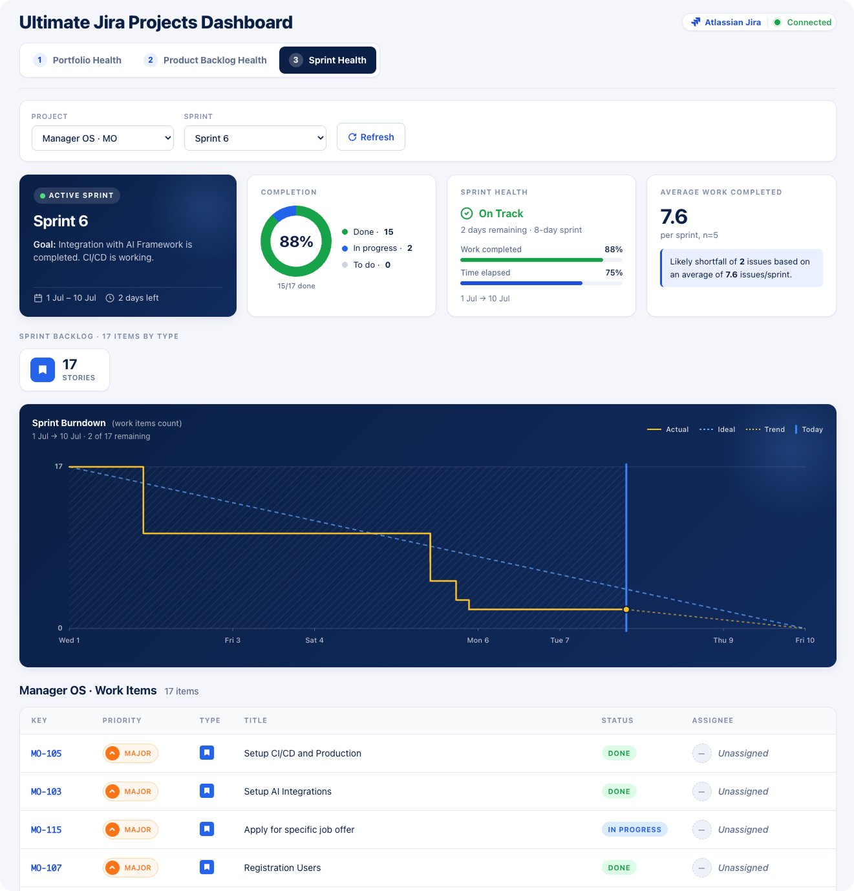

# Ultimate Jira Projects Dashboard — Description

## Overview

The Ultimate Jira Projects Dashboard is a live, three‑level view of Jira health for product and
project managers. It unifies **Portfolio** health across many projects, **Product Backlog** flow and
delivery health, and detailed **Sprint** health — from a multi‑project overview, to backlog flow,
fix‑version release progress and lead/cycle time, down to an active sprint’s burndown and velocity
forecast. Pick a project once and it carries through the tabs, so you can go from a portfolio‑wide
overview to a specific sprint in two clicks; non‑Scrum projects are handled gracefully. Runs as a
Claude Cowork live artifact against your connected Atlassian/Jira account.

---

## Tab 1 — Portfolio Health

> **High‑level, multi‑project overview.** Pick one or more projects and get a scorecard for each: an overall completion donut (Done / In Progress / To Do) with counts and percentages, board and work‑item totals, and per‑type panels for Epics, Stories, Tasks, and Bugs. From any project card you can jump straight into its Backlog or Sprint health.

---

## Tab 2 — Product Backlog Health

> **Mid‑level delivery and flow health for one project.** Choose a project and a time window (2 weeks / 1 / 3 / 6 months). See a completion donut for work created in the period, flow health (created vs. resolved and net flow) and throughput, a cumulative created‑vs‑resolved trend, release progress by Fix Version, lead‑ and cycle‑time analysis, and a paginated work‑items table.

> *Definitions:* **Lead time** = created → resolved (includes backlog wait). **Cycle time** = first In Progress → resolved (active work). The gap is queue/wait time.

---

## Tab 3 — Sprint Health

> **Detailed view of a single sprint.** Select a project and a sprint (active / future / completed). The active‑sprint hero shows the goal and dates, alongside a completion donut, a sprint‑health read (work completed vs. time elapsed → On Track / Watch / At Risk), and a velocity forecast based on past sprints. Below: the sprint backlog by issue type, a burndown chart (actual vs. ideal, with trend and “today” marker), and a paginated work‑items table.

---

## Notes

- Runs as a **Claude Cowork live artifact** and pulls live data through your connected Atlassian/Jira account.
